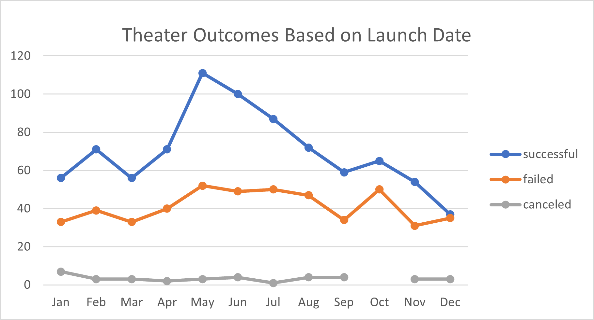
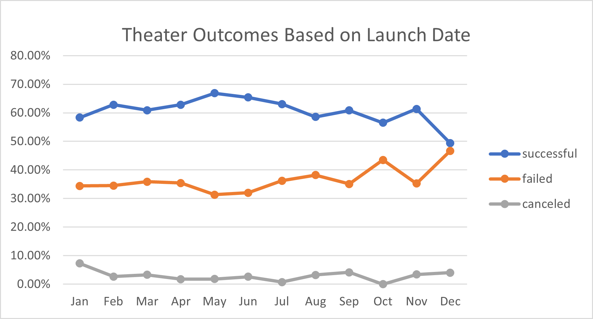
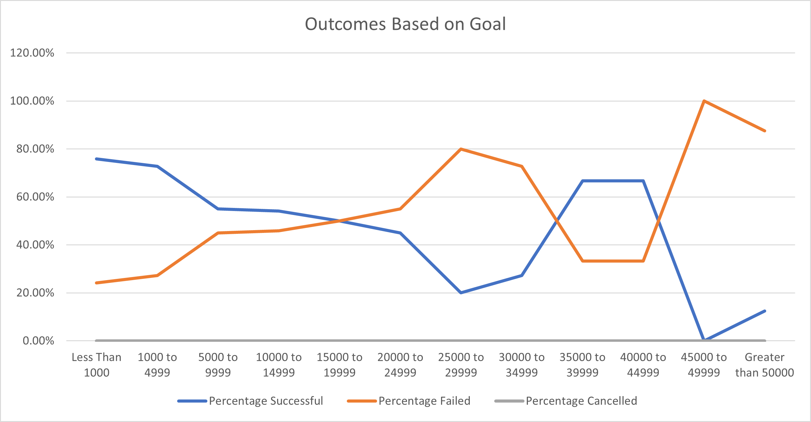

# Analysis of Kickstarter Crowdfunding Campaigns
This is an analysis of factors contributing to success/fail rates on Kickstarter crowdfunding platform performed in Excel.

## Overview of Project

<<<<<<< HEAD
Kickstarter platform helps creators turn their ideas into reality. It’s where creators share new visions for creative work with the communities that will come together to fund them.[1](#myfootnote1)

According to Kickstarter website, since launch in 2009, 20 million people have backed a project, $6.3 billion has been pledged, and 212+ thousand projects have been successfully funded.
The overall success rate for a project hovers just around 40%.[2](#myfootnote1)

### Purpose

What makes a project succeed?

We will take a look at 4K+ crowdfunding campaigns that took place between 2009 and 2017 and will try to identify some of the factors that contribute to a project's funding success.

## Analysis and Challenges

### Analysis of Outcomes Based on Launch Date

We were asked to plot the outcomes of the campaigns in "Theater" category against the launch dates and after doing so we can see that there is a correlation between the number of successful campaigns and the month in which they were launched. For example, there were more successful play campaigns in May than in any other month:

However, we need to be careful drawing any conclusions at this point. For example, we can see from the graph that the number of failed theater campaigns in May is higher as well. This may suggest that the higher numbers of both outcomes are driven by the sheer volume of submissions. To confirm if May submissions truly tend to be more successful, we would need to recreate the chart based on the outcome percentages of total project applications instead of actual numbers:

Here we can see that the success rates for theater campaigns indeed peak in May at around 70% with the lowest success rates (~50%) in December. This could possibly be due to Christmas holidays and many people choosing to spend money on Christmas gifts and preparations for holiday celebrations.

### Analysis of Outcomes Based on Goals

We also took a look at the campaign outcomes for "Play" subcategory vs goals. To make sure we are comparing apples to apples, we have converted the outcomes to percentages and grouped the budget goals into bins of "less than 1000" and subsequent bins of 5000. Projects with budgets under $1000 have the highest success rates (~75%) and success rates steadily decline as the project budgets go up. However, success rates for projects with budgets between 35K-45K jump up to ~70% and then drop back to 0-10% for projects with budget goals over 45K. 

 

The jump in success rates for projects with budgets between 35K-45K is surprising to me and I think there might be more to it than the budget size. To understand full picture of what's driving success for these campaigns we would want to dive deeper into the data and look at other factors, such as the theme of the plays and whether they were featured in spotlight and included on the staff pick lists. Also, when filtering the data on the 35K-45K range (excluding 45K) we can see that there are only 9 records with 6 being successful (~67%) and we need to be careful when  extrapolating the findings from such small sample.

### Challenges and Difficulties Encountered

While doing analysis we encountered a couple of challenges:

- Dates are provided in unix format. To make sure we could use the dates in the analysis, we had to convert the unix-formatted dates into regular dates format using the conversion formula. 

- Some outliers are present in the data. When outliers are present in the dataset, it's better to use median over mean for measure of central tendency because median is more robust while mean is easily skewed by the outliers.

- Some categories have limited number of records. Ideally, we would want to repeat the analysis on a larger dataset. However, when more data is not available and there is no opportunity for extending the dataset, the analysis results need to be taken with a grain of salt. 

## Results

- What are two conclusions you can draw about the Outcomes based on Launch Date? - Projects launched in May have the highest success rates, while projects launched in December have the lowest success rates. 

- What can you conclude about the Outcomes based on Goals? - Campaigns wth smaller budget goals enjoy higher success rates of funding. As the budget goals increase, the success rates go down.

- What are some limitations of this dataset? - The dataset is fairly limited and includes some outliers. When grouping the data into goal size bins, some of the bins only had a few records, which can hardly be representative of the entire population.

- What are some other possible tables and/or graphs that we could create? - We could do a deeper dive into other factors around the campaigns - location, theme, spotlight, staff pick. I think it would also be interesting to look into the price of merchandise available for purchase to help with funding - are campaigns with lower price items more successful or not necessarily?
   

## References:

  [1. Kirkstarter website - About Us](https://www.kickstarter.com/about?ref=global-footer)

  [2. Kirkstarter website - Stats](https://www.kickstarter.com/help/stats?ref=global-footer)

=======
### Purpose

## Analysis and Challenges

### Analysis of Outcomes Based on Launch Date

### Analysis of Outcomes Based on Goals

### Challenges and Difficulties Encountered

## Results

- What are two conclusions you can draw about the Outcomes based on Launch Date?

- What can you conclude about the Outcomes based on Goals?

- What are some limitations of this dataset?

- What are some other possible tables and/or graphs that we could create?
>>>>>>> 2d63278ee2b7c29d29b1306cf9e997cf6aac178e
